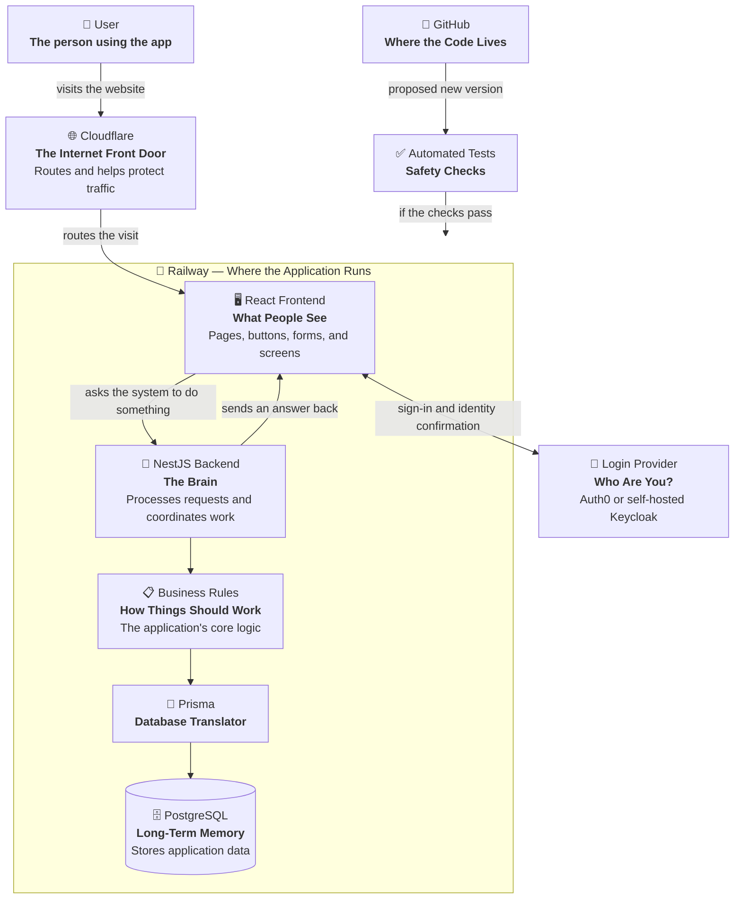
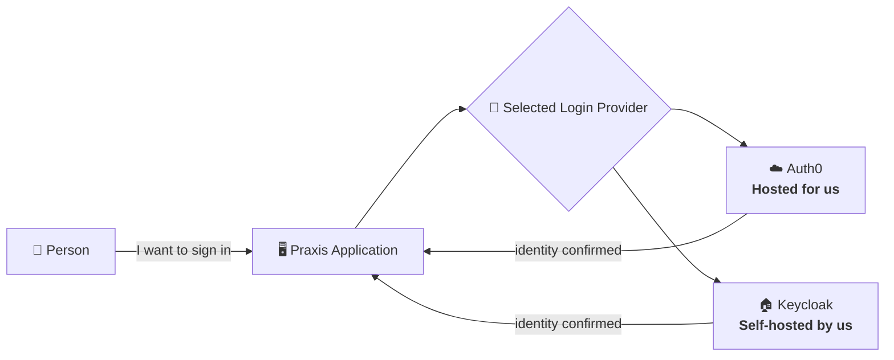
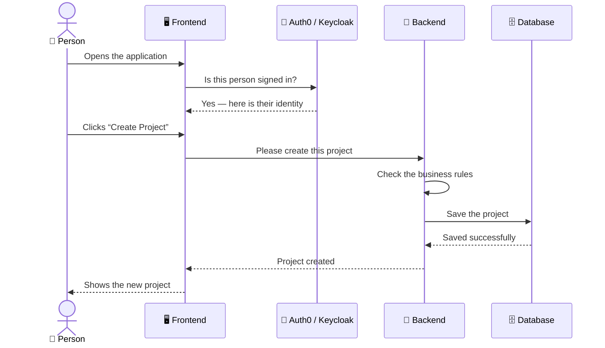
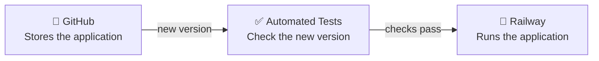
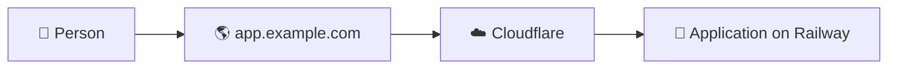
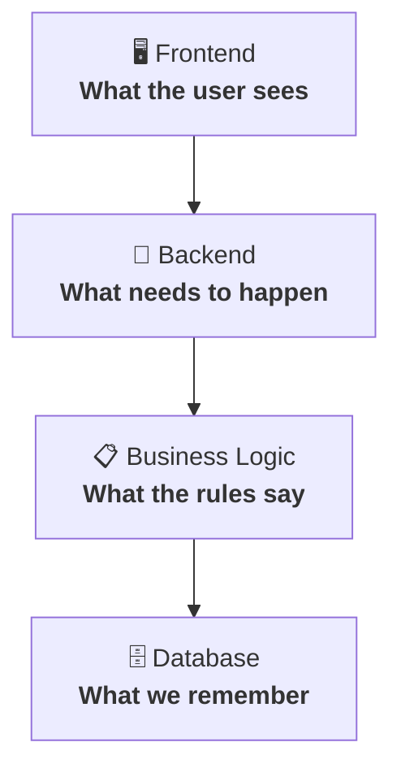

# Praxis Web Template — How Everything Fits Together

> A plain-English map of what each piece does, why it exists, and what it talks to.

You do not need to be a software developer to understand this document.

The shortest explanation is:

**People use the frontend → the frontend asks the backend to do things → the backend applies the rules → the database remembers everything.**

The other services help the application get online, stay secure, identify users, and safely receive updates.

> **Template status:** This repository currently defines the intended architecture and working rules. It does not contain a running frontend or backend yet. Projects created from this template will build the pieces shown below.

## The big picture

## The 30-second explanation

Imagine the application is a restaurant.

### 🖥️ React frontend: the dining room and menu

The **frontend** is everything the customer sees and interacts with.

Buttons, forms, pages, dashboards, menus, messages, tables, and other visual elements live here. **Vite** prepares the frontend files so a web browser can run them.

### 🧠 NestJS backend: the kitchen

The frontend might say:

> “The customer wants to create a project.”

The **backend** figures out what actually needs to happen. It coordinates the work, checks rules, talks to other systems, saves information, and sends the result back.

### 📋 Business rules: the recipes and restaurant rules

These rules answer questions such as:

- Is this action allowed?
- What needs to happen first?
- What information is required?
- What happens when something changes?
- Who is allowed to perform this action?

These rules are intentionally kept separate from screens and databases. That separation helps the rules remain stable even if the appearance of the application or its storage technology changes.

### 🗄️ PostgreSQL: the filing cabinet

**PostgreSQL** is the database. It permanently stores information such as users, projects, settings, relationships, and the application's current state.

Restarting or updating the application does not erase this information.

### 🔄 Prisma: the translator

**Prisma** helps the backend communicate with PostgreSQL. For example, an application request such as “Find Project 123” becomes the appropriate database operation.

## Who handles login?

Login is treated as its own responsibility. A project can use the hosted **Auth0** service or operate its own **Keycloak** service.

### Auth0

Auth0 is a hosted authentication service. It handles much of the security infrastructure surrounding:

- passwords and login,
- account recovery,
- authentication tokens,
- social login, and
- multi-factor authentication.

**Simple version:** We pay someone else to operate the identity system.

### Keycloak

Keycloak performs a similar role but can be **self-hosted**. Instead of relying entirely on a hosted identity company, we run and maintain the authentication server ourselves.

**Simple version:** We gain more control, but we also accept responsibility for keeping the identity system secure, available, backed up, and updated.

Keycloak can be useful when we want:

- more infrastructure control,
- less dependency on an external authentication vendor,
- custom identity behavior, or
- authentication hosted alongside other company-managed infrastructure.

Neither option changes the application's basic responsibility. It needs a trusted identity system capable of answering:

> **“Who is this person, and are they actually signed in?”**

## What happens during a normal action?

The user never talks directly to the database. The frontend does not make final business decisions, and the database does not decide what is allowed. Each piece has one major responsibility.

## How does the application get online?

### 🚂 Railway: where the application lives

Railway is the hosting platform. It provides internet-connected computers where the frontend and backend can run.

**Simple version:** GitHub stores the application; Railway runs it.

### 🌐 Cloudflare: the street address and front entrance

Cloudflare helps manage:

- domain names and DNS,
- HTTPS certificates and encrypted web traffic,
- routing,
- secure tunnels, and
- some security protections.

If the application lives at `app.example.com`, Cloudflare helps the internet determine where that address should go.

**Simple version:** Railway is the building; Cloudflare provides the street address and front entrance.

## Where does the code live?

### 🐙 GitHub: the source of truth

GitHub contains:

- source code,
- documentation,
- change history,
- branches,
- pull requests, and
- reviews.

Developers and AI coding agents work with the project through GitHub.

## What keeps changes from breaking everything?

### ✅ Automated tests: the safety checks

Automated tests are programs whose job is to test other programs. They can repeatedly check questions such as:

- Can a user still sign in?
- Can someone still create a project?
- Does this calculation return the correct answer?
- Does the API reject invalid information?
- Can someone complete an entire workflow?

Before a change is considered finished, the relevant checks should pass.

## Technology map

| Technology | Job | Plain-English version |
|---|---|---|
| **React** | Builds the frontend | What users see |
| **Vite** | Builds and packages React | Prepares the website for a browser |
| **React Router** | Controls navigation | Decides which page to show |
| **Tailwind CSS** | Controls appearance | Handles layout and styling |
| **Formik** | Handles forms | Keeps track of form input |
| **Yup** | Validates form input | Checks for obvious mistakes |
| **NestJS** | Runs the backend | The application's brain |
| **CQRS** | Separates reads from changes | Keeps “ask” and “do” operations organized |
| **Prisma** | Talks to PostgreSQL | The database translator |
| **PostgreSQL** | Stores information | Long-term memory |
| **Auth0** | Provides hosted authentication | A login system operated for us |
| **Keycloak** | Provides self-hosted authentication | A login system we operate ourselves |
| **Railway** | Hosts the application | Where the app lives |
| **Cloudflare** | Routes and helps protect traffic | The internet front door |
| **GitHub** | Stores source code and history | The shared code workspace |
| **Automated tests** | Verify behavior | Safety checks |
| **TypeScript** | Main programming language | The language used to build the app |

## A few terms you will hear

### Frontend

The part of the application a person sees and interacts with.

### Backend

The behind-the-scenes system that performs work.

### API

**Application Programming Interface:** the agreed-upon way one program talks to another. In this application, the frontend usually talks to the backend through an API.

### Database

Software designed to permanently store and retrieve structured information.

### Authentication

Confirming **who you are**.

### Authorization

Determining **what you are allowed to do**.

A person might successfully authenticate as Bob while still not being authorized to view Alice's private project.

### Business logic

The actual rules describing how the product or business works.

### Deployment

Taking a new version of the software and putting it onto the system where people use it.

### Dependency

When one piece of the system needs another piece to perform its job.

## The most important idea

The system intentionally separates responsibilities:

Meanwhile, Auth0 or Keycloak proves who people are, Railway runs the application, Cloudflare gets internet traffic to it, GitHub stores and tracks the code, and automated tests help ensure changes still work.

That is essentially the entire system. There are many technical details underneath each box, but those details are not required to understand what each major piece is responsible for and why it exists.
